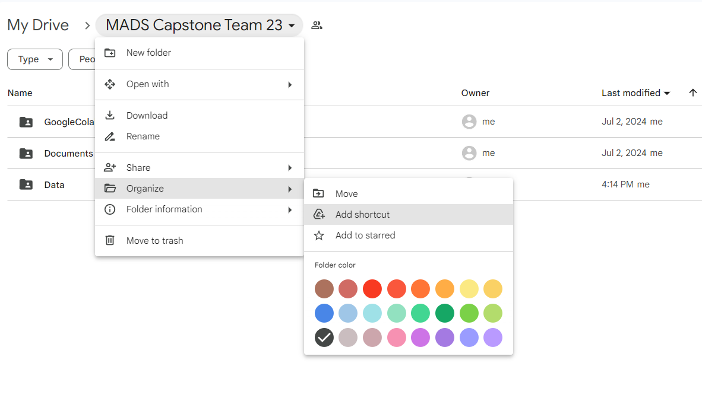
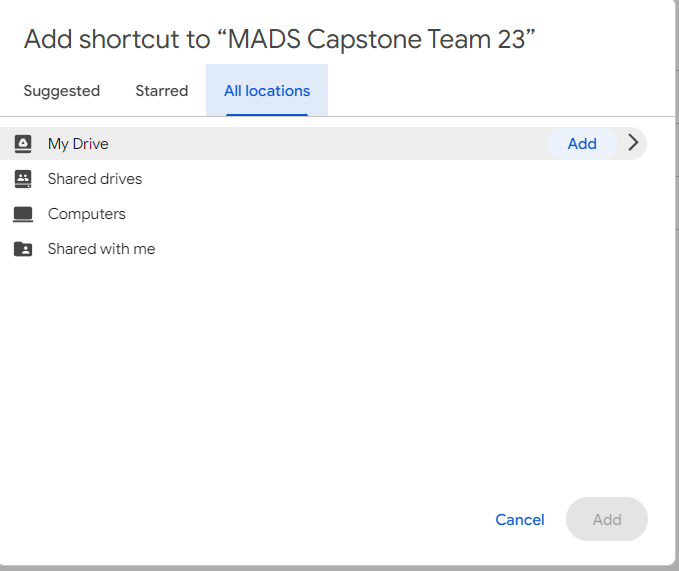
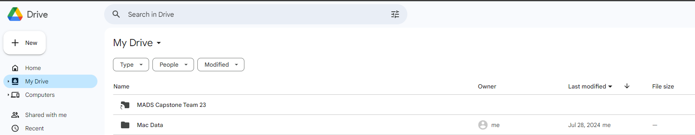
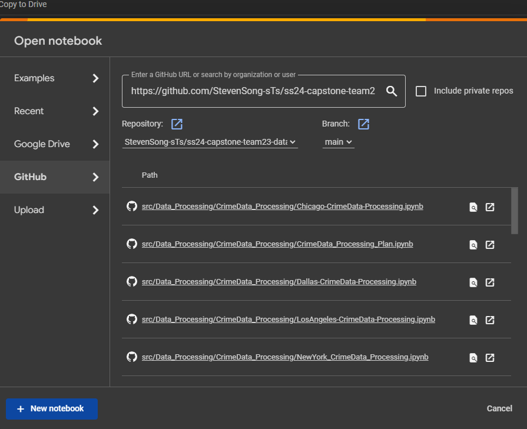
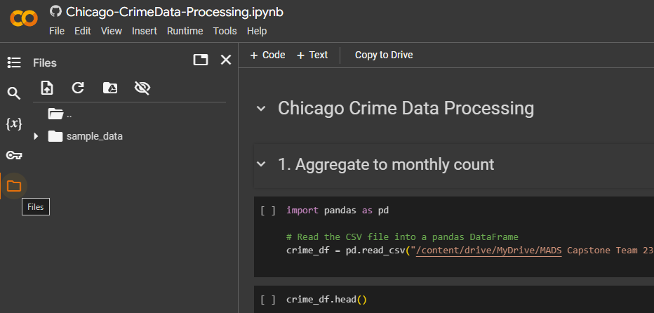
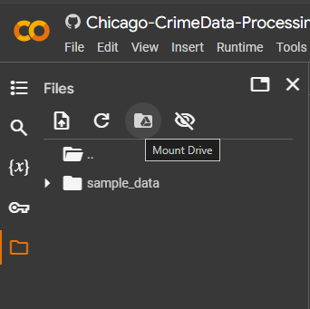
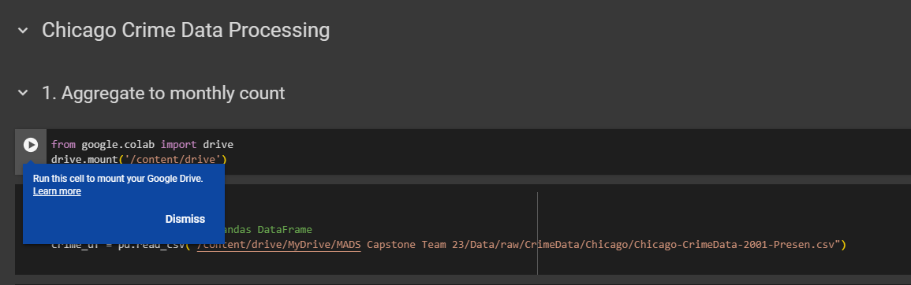
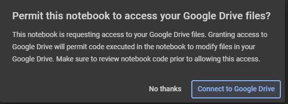
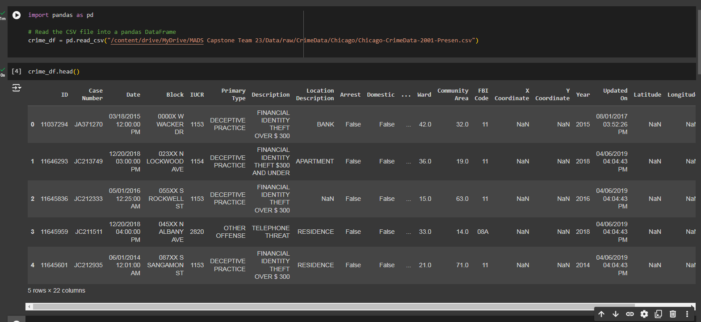

# UMICH Capstone Project - Team 23: Temporal Titan

### Team Members:
 - Daniel Atallah
 - Nathan Kitts
 - Steven Song

## Instructions for Running the Code
This repository contains two primary components: **Data Processing** and **Modeling**.

Due to the large size of the data files, storing them directly in GitHub would lead to long clone times. Therefore, the team has opted to store the data in our Google Drive, while all code is maintained in this GitHub repository.

To efficiently access the raw data files, we recommend using [**Google Collab**](https://colab.research.google.com/), which allows you to mount your Google Drive and work directly with the data.

Given this setup, the instructions for running the Data Processing code and the Modeling code differ slightly.

### 1. Running the Data Processing Code:
#### Step1: Access Team's Google Drive
Please visit the link below to access team's Google Drive. This folder is public and anyone with the link wil be able to read the content.

Link: https://drive.google.com/drive/folders/1yyb5Pu5pS4b7468yDXhn6lWfF0EHinlb?usp=sharing

#### Step2: Add Shortcut to your Drive
1. Add a shortcut to team's drive in order to see it in the Google Collab later.


2. In the pop up window, go to **All locations** tab, then click the 'Add' button to add shortcut to  'My Drive' 


#### Step3: Validate Team's Drive Exist Under 'My Drive'
Click `My Drive`button on the left side bar, we should be able to see a shortcut to team23's drive has been added


#### Step4: Open Code in the Google Collab
Next, we are ready to run the code in the Google Collab. Go to the below link and signin with your Google account.

Link: https://colab.research.google.com/

Then, select the `Github` in the pop up window and copy the link of this Github Repo to the input box

Github Repo Link: https://github.com/StevenSong-sTs/ss24-capstone-team23-datallah-nkitts-steveso 



As we can see, all the files will appear in the scroll section below. Any code under the path: `src/Data_Processing` can be run here

#### Step5: Mount Drive to the Google Collab
Open `Chicago-CrimeData-Processing.ipynb` as an exmaple. 

1. Click the Folder Icon at the left side bar.


2. Click `Mount Drive` button <br>


3. Then a code block will be generated to connect to your Google Drive


4. Run this code block and following the instruction to connect to your Drive


#### Step6: Run the Code
One the connection to G drive has been setup, the notebook are ready to run!



> **Note:** Running a different notebook might requires repeat this process. Please follow the same procedure to connect to the Google drive


### 2. Running the Modeling code:
#### Step 1: Identify Your Operating System
Different operating systems require different versions of the packages. Two separate requirements.txt files are provided. Please ensure you identify the operating system you are using.

#### Step 2: Install the Required Packages Using the Correct requirements.txt File

For macOS or Linux: Use requirements_mac_linux.txt.
F
or Windows: Use requirements_windows.txt.

To install the required packages, run the following command in your terminal or command prompt:

```bash
pip install -r requirements_{YOUR OS}.txt
```

> **Note:** The team has developed this project using Python 3.11.9. Using a different Python version may result in compatibility issues or errors. It is recommended to use Python 3.11.9.
> 
> Using Python 3.11.9 is recommnded.

#### Step3: Run the Code
Once all the packages are installed, you can run the notebook in any IDE of your choice that supports Jupyter runtime.